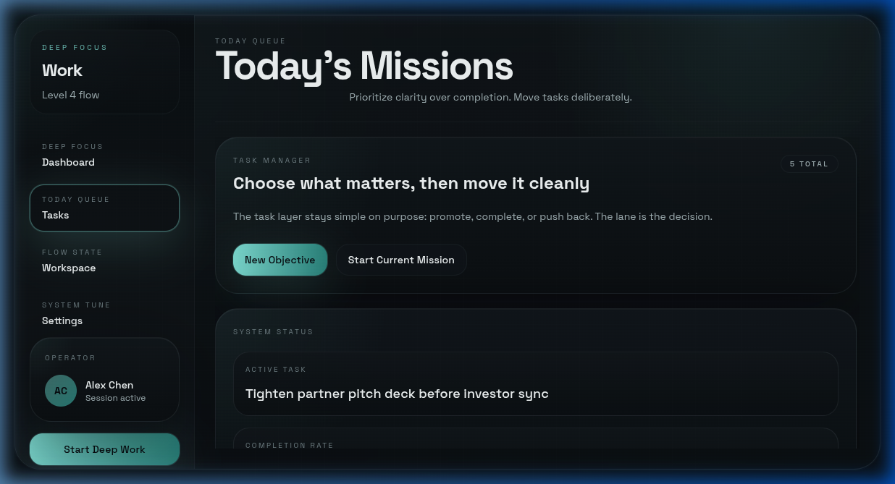
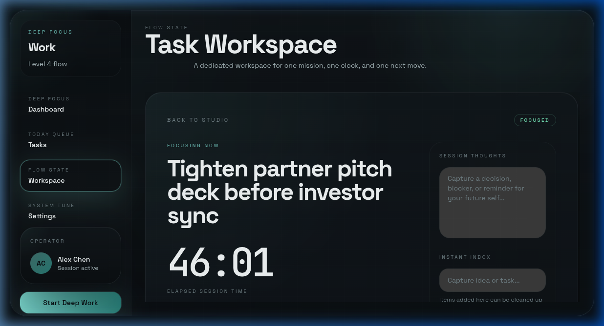
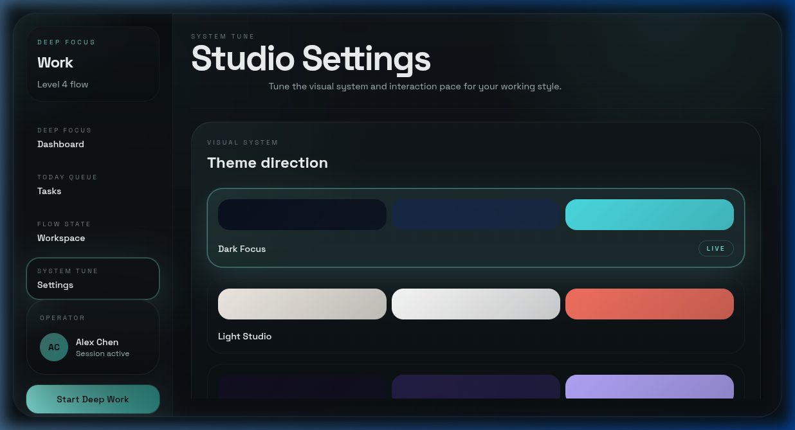

<div align="center">

# 🎯 MissionControl

### The desktop workspace that keeps you locked in.

**One mission. One clock. Total clarity.**

[](https://v2.tauri.app)
[](https://react.dev)
[](https://typescriptlang.org)
[](https://rust-lang.org)
[](https://sqlite.org)
[](LICENSE)

<br/>


<br/>

*A premium desktop productivity studio built with Tauri 2, React 19, and Rust.*
*Designed for people who think in missions, not to-do lists.*

</div>

---

## 🪟 Install On Windows

If you just want to use MissionControl on Windows, start here:

1. Open the [latest release](https://github.com/deepakraaaj/MissionControl/releases/latest).
2. Under **Assets**, download the Windows installer (`.msi` or `.exe`).
3. Double-click the installer and keep the default options.
4. Open **MissionControl** from the Start menu.
5. In **Settings**, enable **Launch at login** if you want the HUD ready when Windows starts.

**No Node.js, Rust, or terminal setup required for normal use.**

---

## ✨ What Makes MissionControl Different

MissionControl isn't another task app. It's a **focus operating system** for your desktop.

Most productivity tools optimize for *capturing everything*. MissionControl optimizes for **finishing one thing at a time** — with a beautiful interface that respects your attention.

<table>
<tr>
<td width="50%">

### 🧠 Focus-First Design
Every pixel is designed to reduce cognitive load. The dashboard shows exactly what matters: your active mission, session clock, and momentum metrics — nothing else.

### 🪟 Multi-Window Architecture
Three purpose-built surfaces for three states of mind:
- **Main App** — Plan and prioritize
- **HUD Overlay** — Stay focused (always-on-top)
- **Quick Add** — Capture without breaking flow

</td>
<td width="50%">

### 🎨 4 Premium Themes
Switch between visual modes that match your energy:
- **Dark Focus** — Deep navy + cyan for deep work
- **Light Studio** — Warm paper tones for planning
- **Midnight Purple** — Velvet indigo for late nights
- **Zen Mode** — Sage + sand for calm flow

### ⌨️ Keyboard-First
Every interaction has a keyboard shortcut. Quick Add launches with `Ctrl+Shift+Space` from anywhere on your desktop.

</td>
</tr>
</table>

---

## 📸 Screenshots

<div align="center">

### Dashboard — Focus Flow
*Your command center. Active mission, session metrics, weekly rhythm, and lane signals at a glance.*


---

### Tasks — Mission Board
*Kanban-style lanes: Queue → Active → Next → Backlog. Move tasks deliberately.*



---

### Workspace — Deep Focus
*One mission. One timer. Session notes and sub-tasks. Everything else fades away.*



---

### Settings — Theme Studio
*Four curated palettes. Motion controls. Prompt style tuning.*



</div>

---

## 🏗️ Architecture

```
MissionControl
├── src/                        # React + TypeScript frontend
│   ├── app/                    # 3 window entry points
│   │   ├── main/               # Main application shell
│   │   ├── hud/                # Always-on-top HUD overlay
│   │   └── quick-add/          # Global quick capture popup
│   ├── components/ui/          # Design system primitives
│   │   ├── badge.tsx           # Status badges
│   │   ├── button.tsx          # Buttons (primary/secondary/ghost)
│   │   ├── card.tsx            # Glassmorphic cards
│   │   ├── input.tsx           # Text fields + textareas
│   │   └── window-drag-handle  # Custom window chrome
│   ├── features/
│   │   ├── tasks/              # Task CRUD, lanes, sorting, seed data
│   │   ├── focus/              # Focus sessions, timer, HUD state
│   │   ├── themes/             # 4 tokenized themes
│   │   ├── ai/                 # AI provider (mock → ready for real LLM)
│   │   ├── settings/           # App preferences
│   │   ├── preferences/        # Persisted user prefs
│   │   └── activity/           # Activity logging
│   ├── lib/                    # Utilities (Tauri bridge, DB, dates)
│   └── styles/globals.css      # Design tokens + CSS layers
├── src-tauri/                  # Rust backend
│   ├── src/main.rs             # App entry + Linux sanitization
│   ├── tauri.conf.json         # Multi-window + capability config
│   └── capabilities/           # Tauri 2 permission system
├── docs/                       # Landing page + screenshots
└── dist/                       # Production build output
```

### Tech Stack

| Technology | Purpose |
|-----------|---------|
| **Tauri 2** | Native desktop shell, multi-window, system tray, global shortcuts |
| **React 19** | Component UI with concurrent features |
| **TypeScript** | End-to-end type safety |
| **Rust** | Backend process, Snap/GTK sanitization, plugin system |
| **Zustand** | Lightweight reactive state (4 stores) |
| **Framer Motion** | Page transitions, entrance animations |
| **SQLite** | Persistent storage via `@tauri-apps/plugin-sql` |
| **TailwindCSS 3** | Utility styling bound to CSS custom property tokens |
| **Space Grotesk** | Primary UI font |
| **JetBrains Mono** | Monospace for timers and data |

---

## 🛠️ Developer Setup

If you want to run or build MissionControl from source, use the steps below.

### Prerequisites
- **Node.js** ≥ 18
- **Rust** toolchain (for native builds)
- **System dependencies** (Ubuntu/Debian):
  ```bash
  sudo apt install build-essential libssl-dev libglib2.0-dev libgtk-3-dev \
      libayatana-appindicator3-dev librsvg2-dev libsoup-3.0-dev \
      libwebkit2gtk-4.1-dev libxdo-dev
  ```

### Install & Run

```bash
# Clone the repo
git clone https://github.com/deepakraaaj/MissionControl.git
cd MissionControl

# Install dependencies
npm install

# Run in browser (development)
npm run dev

# Run as native desktop app
npm run tauri:dev
```

### Build for Production

```bash
# Build the native desktop app
npm run tauri:build
```

---

## ⌨️ Keyboard Shortcuts

| Shortcut | Action |
|----------|--------|
| `Ctrl+Shift+Space` | Open Quick Add (global) |
| `Ctrl+Enter` | Save task (in Quick Add) |
| `Escape` | Close Quick Add / dismiss |
| `Enter` / `Space` | Select focused task |

---

## 🎨 Theming

MissionControl uses a **tokenized CSS custom property system**. Every color, shadow, and surface is a design token — swap the entire palette by changing one `data-theme` attribute.

```css
/* Dark Focus (default) */
--accent: 130 231 220;    /* Crisp cyan */
--bg-base: 6 10 12;       /* Deep navy */

/* Midnight Purple */
--accent: 161 189 255;    /* Soft lavender */
--bg-base: 13 10 23;      /* Velvet indigo */
```

Adding a new theme is a single CSS block + one entry in `src/features/themes/themes.ts`.

---

## 🧩 The AI Layer

The architecture includes a **pluggable AI provider** abstraction:
- **Title refinement** — Cleans raw input into scannable task titles
- **Subtask suggestions** — Generates contextual next steps
- **Clarifying questions** — Prompts for missing details

Currently uses a mock provider that works offline. The interface is ready for integration with any LLM backend (OpenAI, local models, etc).

---

## 📋 Roadmap

- [x] **Phase 1** — Foundation: multi-window shell, design system, task model, theme engine
- [ ] **Phase 2** — Task Flow: real CRUD, lane changes, SQLite persistence, HUD sync
- [ ] **Phase 3** — Intelligence: real AI integration, smart scheduling, focus analytics
- [ ] **Phase 4** — Platform: system tray, notifications, cross-platform builds

---

## 🤝 Contributing

1. Fork the repo
2. Create a feature branch: `git checkout -b feature/amazing-feature`
3. Commit your changes: `git commit -m 'Add amazing feature'`
4. Push to the branch: `git push origin feature/amazing-feature`
5. Open a Pull Request

---

## 📄 License

This project is licensed under the MIT License — see the [LICENSE](LICENSE) file for details.

---

<div align="center">

**Built with obsessive attention to detail.**

*MissionControl — because your work deserves a premium interface.*

<br/>

[⬆ Back to top](#-missioncontrol)

</div>
