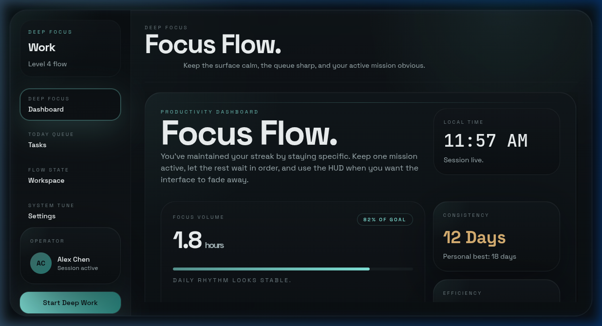

<div align="center">

# 🔄 SynCatch

### The Desktop Workspace for Deep Focus.

**One mission. One clock. Total clarity.**

[](https://v2.tauri.app)
[](https://react.dev)
[](https://typescriptlang.org)
[](https://rust-lang.org)
[](https://sqlite.org)
[](https://supabase.com)

<br/>



<br/>

*A premium desktop productivity studio built with Tauri 2, React 19, and Rust.*
*Designed for people who think in **missions**, not to-do lists.*

</div>

---

## 🚀 The Philosophy

SynCatch isn't another task app. It's a **Focus Operating System** for your desktop.

Most productivity tools optimize for *capturing everything*. SynCatch optimizes for **finishing one thing at a time**. It respects your attention with a beautiful, distraction-free interface that lives where you work — helping you move from "busy" to "impactful."

> **SynCatch** — *"Sync aachaa?"* Everything in sync, everything caught. The mark is two interlocking loops: your intentions and your time, locked together.

---

## ✨ Core Features

### 🎯 Missions & Tasks
A two-tier model that mirrors how real work is structured. Every **Mission** is a project; every **Task** belongs to a mission and carries its own timers, energy, and "Definition of Done." First-class subtasks, smart capture, and a focused **What Now?** view keep you on the single next action.

### 🧠 Focus-First Dashboard
Every pixel is designed to reduce cognitive load. The dashboard shows exactly what matters: your active mission, session clock, and momentum metrics. No clutter, just flow.

### 🪟 Multi-Window Architecture
Three purpose-built surfaces for three states of mind:
- **Main App** — Plan, prioritize, and review your high-level roadmap.
- **HUD (Always-on-Top)** — A minimalist floating overlay that keeps your active task visible across every workspace.
- **Quick Add** — A global popup (`Ctrl+Shift+Space`) to capture ideas without breaking your current focus.

### 🤖 AI Assistant (Cerebras-Powered)
A conversational agent that actually *operates* the app for you. Powered by [Cerebras](https://cerebras.ai) inference (default model `gpt-oss-120b`), it takes real actions through a tool-calling interface:

| | |
|---|---|
| 📋 Tasks | list · create · update · complete · delete |
| 🎯 Missions | list · create |
| 📔 Journal | create entries · set mood & gratitude |
| ⏱️ Focus | start / stop sessions |
| 📊 Insight | today's summary at a glance |

Ask *"start a deep-work session on the auth refactor"* and it just happens.

### 📔 Journal & 📝 Notes
- **Journal** — Daily reflections with mood and gratitude tracking, linkable to missions.
- **Notes** — A full rich-text notepad built on **Tiptap/ProseMirror**: bold, italic, underline, headings, lists, links, inline images, and a distraction-free fullscreen mode. Notes are categorized, pinnable, and mission-linkable.

### 📊 Distraction & Session Analytics
Stop guessing where your time goes. SynCatch tracks:
- **Deep Work Sessions** — Log focus periods and associate them with specific missions.
- **Distraction Logging** — Categorize interruptions (Messages, People, Internal) and get actionable **Avoidance Tips**.
- **Momentum Metrics** — Visualize your daily and weekly rhythm to work with your peak energy.

### ☁️ Hybrid Persistence
Choose how you work:
- **Local Mode** — High-performance SQLite storage. Your data stays on your machine, always offline-first.
- **Cloud Sync** — Securely sync across devices via Supabase auth + storage for a seamless multi-device experience.

### 🎨 Premium Design System
Six curated themes that match your work energy:

| Theme | Mood |
|-------|------|
| **Dark Focus** | Deep navy + crisp cyan for intense deep work |
| **Light Studio** | Warm paper tones for planning and brainstorming |
| **Midnight Purple** | Velvet indigo for late-night productivity |
| **Zen Mode** | Sage + sand for calm, steady flow |
| **Solar Flare** | Warm amber for high-energy sprints |
| **Rose Quartz** | Soft rose for a gentler workspace |

---

## 🛠️ Technical Specifications

### Frontend Stack
- **React 19** — Latest concurrent features for a fluid UI.
- **TypeScript 5** — Strict type safety across the entire application.
- **Vite 5** — Ultra-fast HMR and optimized build pipelines.
- **Zustand 5** — Lightweight, reactive state management.
- **Framer Motion 12** — Smooth, high-performance layout transitions.
- **TailwindCSS 3** — Utility-first styling bound to a tokenized CSS custom-property theme system.
- **Tiptap 3 / ProseMirror** — Robust, schema-based rich-text editing for Notes.

### Backend & OS Integration (Tauri 2)
- **Rust Backend** — High-performance, memory-safe desktop shell.
- **Tauri Plugin SQL** — Reliable local persistence via SQLite.
- **Global Shortcut Plugin** — System-wide listeners for instant task capture.
- **Autostart Plugin** — Integrates into your OS login flow.
- **Window Management** — Custom handling for transparent, always-on-top, taskbar-skipping windows.
- **IPC** — Reactive state synchronization across independent Tauri windows via the Tauri event system.

### AI & Cloud
- **Cerebras Chat Completions** — Tool-calling agent loop (`src/lib/cerebras.ts`).
- **Supabase** — Auth and cloud storage for cross-device sync.

### Typography & Assets
- **Space Grotesk** — Primary UI font, modern and architectural.
- **JetBrains Mono** — Monospace for precision timers and data metrics.
- **Lucide Icons** — Consistent, lightweight vector iconography.

---

## 📱 Mobile Support (Android)

SynCatch is truly cross-platform. The current architecture supports:
- **Mobile-Responsive UI** — Layouts that adapt from 27" monitors to 6" phone screens, with a dedicated bottom navigation.
- **Native Android Pipeline** — Scripts for environment validation, emulator testing, and signed release APKs.

---

## 💿 Installation

### Windows
1. Download the latest `.msi` or `.exe` from [Releases](https://github.com/deepakraaaj/SynCatch/releases).
2. Run the installer and launch **SynCatch**.

### Linux (Ubuntu/Debian)
1. Download the latest `.deb` package from [Releases](https://github.com/deepakraaaj/SynCatch/releases).
2. Install via terminal:
   ```bash
   sudo apt install ./SynCatch_<version>_amd64.deb
   ```

### Android
- Download the `.apk` from the latest release assets, or build from source using the provided scripts.

---

## 🏗️ Developer Setup

### Prerequisites
- **Node.js** ≥ 18
- **Rust** toolchain (stable)
- **System dependencies** (Ubuntu):
  ```bash
  sudo apt install build-essential libssl-dev libglib2.0-dev libgtk-3-dev \
      libayatana-appindicator3-dev librsvg2-dev libsoup-3.0-dev \
      libwebkit2gtk-4.1-dev libxdo-dev
  ```

### Clone & Install
```bash
git clone https://github.com/deepakraaaj/SynCatch.git
cd SynCatch
npm install
```

### Environment Variables
Create a `.env.local` in the project root. All keys are optional — the app runs fully in offline/local mode without them.

```bash
# AI Assistant (optional)
VITE_CEREBRAS_API_KEY=your_cerebras_key
VITE_CEREBRAS_MODEL=gpt-oss-120b          # default if omitted

# Cloud Sync (optional)
VITE_SUPABASE_URL=your_supabase_url
VITE_SUPABASE_ANON_KEY=your_supabase_anon_key
```

### Scripts
| Command | Description |
|---------|-------------|
| `npm run tauri:dev` | Launch the desktop development environment |
| `npm run dev` | Run the web frontend only (Vite) |
| `npm run build` | Type-check and build the frontend |
| `npm run lint` | Run ESLint across the project |
| `npm run tauri:build` | Build production installers for the current platform |
| `npm run android:build:release` | Generate a production Android APK |
| `npm run android:test:emulator` | Build and validate on an Android emulator |

---

## ⌨️ Keyboard Mastery

| Shortcut | Action |
|----------|--------|
| `Ctrl+Shift+Space` | Open Quick Add (global) |
| `Ctrl+Shift+H` | Toggle HUD transparency |
| `Ctrl+Enter` | Save task / confirm |
| `Escape` | Close popup / dismiss |
| `Tab` | Focus navigation |

---

## 🗂️ Project Structure

```
src/
├── app/              # Window entrypoints (main, hud, quick-add) + bootstrap
├── features/
│   ├── missions/     # Projects (Missions)
│   ├── tasks/        # Tasks, subtasks, composer, detail panel
│   ├── focus/        # Focus sessions + timers
│   ├── sessions/     # Deep-work session tracking
│   ├── activity/     # Distraction & momentum analytics
│   ├── journal/      # Mood, gratitude, daily reflections
│   ├── notes/        # Rich-text notepad (Tiptap)
│   ├── assistant/    # Cerebras AI agent (chat + tools)
│   ├── auth/ · sync/ # Supabase auth + cloud sync
│   ├── themes/       # Theme tokens & switching
│   └── ...
├── components/ui/    # Shared UI primitives (incl. rich-text-editor)
├── lib/              # cerebras, supabase, sync-engine, helpers
└── styles/           # Global CSS + theme custom properties
src-tauri/            # Rust backend, window config, plugins
```

---

## 📚 Documentation

Deeper guides live in [`docs/`](docs/):

| Doc | What's inside |
|-----|---------------|
| [Installation](docs/installation.md) | Installing SynCatch on Ubuntu (`.deb` / AppImage) |
| [Developer Guide](docs/developer-guide.md) | Run in debug mode (desktop + Android), environment setup, troubleshooting |
| [Releasing](docs/releasing.md) | How to push, tag, and publish a release via CI |
| [Android Release](docs/android-release.md) | Building and signing Android APKs |
| [Release Troubleshooting](docs/release-troubleshooting.md) | Fixes for issues hit during release builds |
| [Supabase Setup](docs/supabase-setup.md) | Cloud sync auth + storage setup |

---

## 📄 License

Released under the **MIT License**. See [LICENSE](LICENSE) for details.

---

<div align="center">

**Built with obsessive attention to detail.**
*SynCatch — because your work deserves a premium interface.*

[⬆ Back to top](#-syncatch)

</div>
