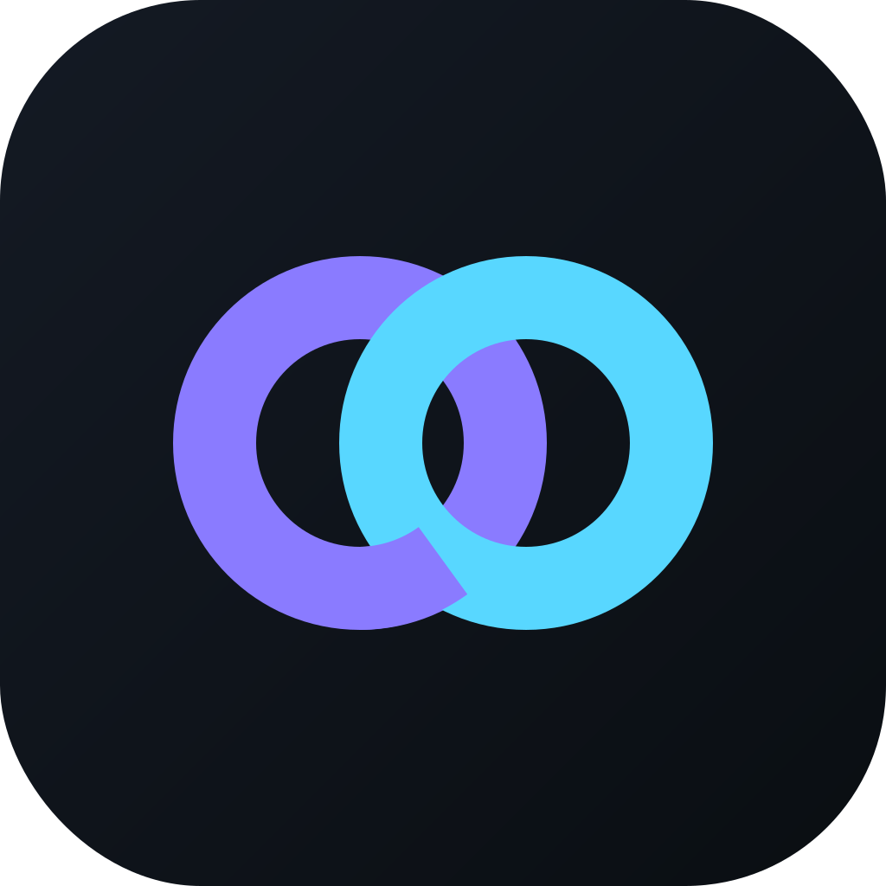

<div align="center">



# SynCatch

**The desktop workspace for deep focus.**

One mission. One clock. Total clarity.

<p>
  
  
  
  
  
  
</p>

</div>

---

## Overview

SynCatch is a focus operating system for your desktop, built with Tauri 2, React 19, and Rust.

Most productivity tools optimize for capturing everything. SynCatch optimizes for finishing one thing at a time — a fast, distraction-free workspace that lives where you work and helps you move from busy to impactful. It's designed for people who think in **missions**, not to-do lists.

> *"Sync aachaa?"* — everything in sync, everything caught. The mark is two interlocking loops: your intentions and your time, locked together.

---

## Features

**Missions & Tasks.** A two-tier model that mirrors real work — every Mission is a project, every Task belongs to one and carries its own timers, energy, and Definition of Done. First-class subtasks, smart capture, and a focused *What Now?* view keep you on the single next action.

**Multi-window architecture.** Three purpose-built surfaces: the Main app for planning, an always-on-top HUD that keeps your active task visible across every workspace, and a global Quick Add popup (`Ctrl+Shift+Space`) for capturing without breaking focus.

**AI assistant.** A conversational agent powered by [Cerebras](https://cerebras.ai) inference (`gpt-oss-120b`) that actually operates the app through tool calls — create and complete tasks, manage missions, log journal entries, start and stop focus sessions, and pull a daily summary.

**Journal & notes.** Daily reflections with mood and gratitude tracking, plus a full rich-text notepad built on Tiptap/ProseMirror — headings, lists, links, inline images, and a distraction-free fullscreen mode. Notes are categorized, pinnable, and mission-linkable.

**Analytics.** Deep-work session logging, categorized distraction tracking with avoidance tips, and momentum metrics that visualize your daily and weekly rhythm.

**Hybrid persistence.** Offline-first local SQLite by default, with optional Supabase auth and cloud sync for a seamless multi-device experience.

**Six themes.** Dark Focus, Light Studio, Midnight Purple, Zen Mode, Solar Flare, and Rose Quartz — each tuned to a different work energy.

**Cross-platform.** A responsive UI that adapts from a 27" monitor to a 6" phone, with a native Android build pipeline.

---

## Tech Stack

| Layer | Technologies |
|-------|--------------|
| Frontend | React 19, TypeScript 5, Vite 5, Zustand 5, Framer Motion 12, TailwindCSS 3 |
| Editor | Tiptap 3 / ProseMirror (rich-text notes) |
| Desktop shell | Tauri 2, Rust, plugin-sql (SQLite), global-shortcut, autostart |
| AI & cloud | Cerebras chat completions, Supabase auth + storage |
| Design | Space Grotesk, JetBrains Mono, Lucide icons, tokenized CSS theme system |

---

## Installation

Download the latest build from [Releases](https://github.com/deepakraaaj/SynCatch/releases).

```bash
# Ubuntu / Debian
sudo apt install ./SynCatch_<version>_amd64.deb

# Or run the portable AppImage
chmod +x SynCatch_<version>_amd64.AppImage && ./SynCatch_<version>_amd64.AppImage
```

Windows users can run the `.msi` / `.exe`; Android users can install the `.apk`. See the [Installation guide](docs/installation.md) for details and troubleshooting.

---

## Development

**Prerequisites:** Node.js ≥ 18, the Rust toolchain, and (on Ubuntu) the system libraries below.

```bash
sudo apt install build-essential libssl-dev libglib2.0-dev libgtk-3-dev \
    libayatana-appindicator3-dev librsvg2-dev libsoup-3.0-dev \
    libwebkit2gtk-4.1-dev libxdo-dev
```

```bash
git clone https://github.com/deepakraaaj/SynCatch.git
cd SynCatch
npm install

npm run tauri:dev   # desktop app with hot reload + devtools
npm run dev         # web frontend only → http://localhost:1420
```

Optional `.env.local` (the app runs fully offline without it):

```bash
VITE_CEREBRAS_API_KEY=your_key      # AI assistant
VITE_CEREBRAS_MODEL=gpt-oss-120b    # optional, this is the default
VITE_SUPABASE_URL=your_url          # cloud sync
VITE_SUPABASE_ANON_KEY=your_anon_key
```

| Command | Description |
|---------|-------------|
| `npm run tauri:dev` | Desktop development with hot reload |
| `npm run dev` | Web frontend only |
| `npm run build` | Type-check and build the frontend |
| `npm run lint` | Run ESLint |
| `npm run tauri:build` | Build production installers |
| `npm run android:build:release` | Build a signed Android APK |

Full setup, Android debugging, and release workflow are in the [docs](#documentation).

---

## Keyboard Shortcuts

| Shortcut | Action |
|----------|--------|
| `Ctrl+Shift+Space` | Open Quick Add (global) |
| `Ctrl+Shift+H` | Toggle HUD transparency |
| `Ctrl+Enter` | Save / confirm |
| `Escape` | Close popup |

---

## Project Structure

```
src/
├── app/              Window entrypoints (main, hud, quick-add) + bootstrap
├── features/         missions · tasks · focus · sessions · activity ·
│                     journal · notes · assistant · auth · sync · themes
├── components/ui/    Shared UI primitives (incl. rich-text editor)
├── lib/              cerebras · supabase · sync-engine · helpers
└── styles/           Global CSS + theme tokens
src-tauri/            Rust backend, window config, plugins
```

---

## Documentation

| Guide | Contents |
|-------|----------|
| [Installation](docs/installation.md) | Installing on Ubuntu (`.deb` / AppImage) |
| [Developer Guide](docs/developer-guide.md) | Debug mode (desktop + Android), environment, troubleshooting |
| [Releasing](docs/releasing.md) | Pushing, tagging, and publishing a release |
| [Android Release](docs/android-release.md) | Building and signing Android APKs |
| [Release Troubleshooting](docs/release-troubleshooting.md) | Fixes for release build issues |
| [Supabase Setup](docs/supabase-setup.md) | Cloud sync auth + storage |

---

## License

Released under the [MIT License](LICENSE).
